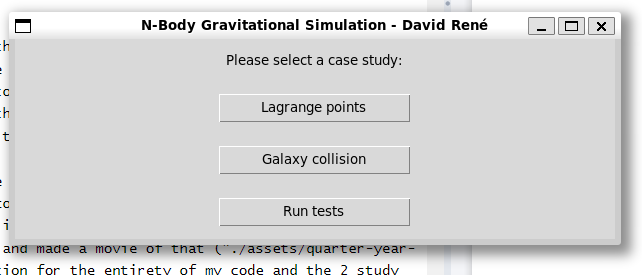
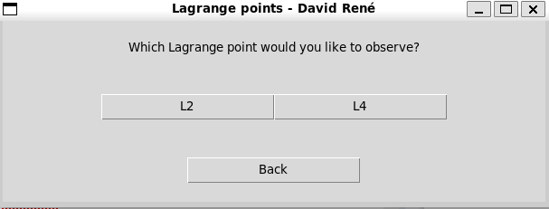
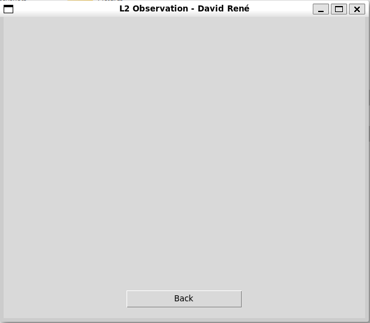

# Numerical analysis of the gravitational $n$-body problem

As part of my term project for University of Waterloo's PHYS349 - Advanced Computational Physics, I will develop a model for the gravitational $n$-body problem, with an extra challenge to create a user interface.

### File structure

```
|- assets
|- tex
|- logs
|- src
|  |- tests
|  |- v1
|  |- v2
|  |- view
```

- assets: contains all the images and other files used in the project
- tex: contains the LaTeX files for the report
- src: contains all the source code
- tests: contains all the unit tests
- v1: contains the first version of the project
- v2: contains the second version of the project
- view: contains the user interface
- logs: contains the logs of the unit tests

# Running it

Running the project is as simple as running the following command:

```
python3 src/main.py
```

Unfortunately, the GUI is not fully implemented, therefore nothing can be done from the actual application, other than running the tests.

# Tests

Tests are located in `assets/tests`. To run the tests, run the following command:

```
python3 src/tests/test_v1.py
```

Tests are run using the `unittest` module. The logs are saved in `logs/`. All tests are passed.

# Model

The model is located in `src/v2/model1.py`. It contains a constructor that allows to build the study cases of Lagrange points and Galaxy collision easily, as well as a Leapfrog numerical integrator.

# User interface

It is not fully implemented yet, but it is located in `src/view/`. It is built using `tkinter`. The "Run tests" button actually runs the test suite and logs the results in `logs/`. The 3rd picture shows where the L2 observation animation would appear.'






